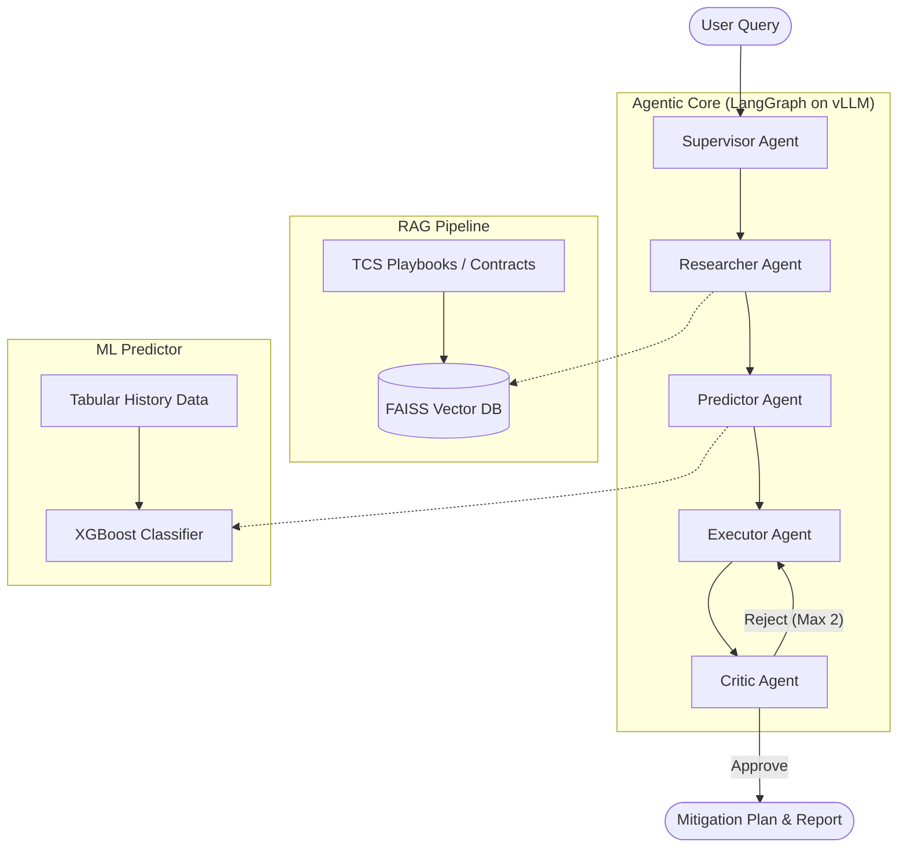

# ASCRO Architecture

ASCRO relies on a multi-agent orchestration framework (LangGraph) integrated with an ML Predictor and RAG.

## Component Flow

## Agent Roles
1. **Supervisor Agent**: Extracts parameters and routes.
2. **Researcher Agent**: Performs similarity search against `data/docs` to find relevant supplier contracts, geographical risk profiles, and internal TCS mitigation playbooks.
3. **Predictor Agent**: Translates text parameters into numerical features. Queries the XGBoost model to get a real-time risk score and probability of supply chain failure.
4. **Executor Agent**: Combines context from the Researcher and the numeric risk assessment from the Predictor to formulate an exact step-by-step mitigation plan.
5. **Critic Agent**: Reviews the Executor's plan for feasibility and hallucinations. Sends it back if it does not address the risk adequately.
